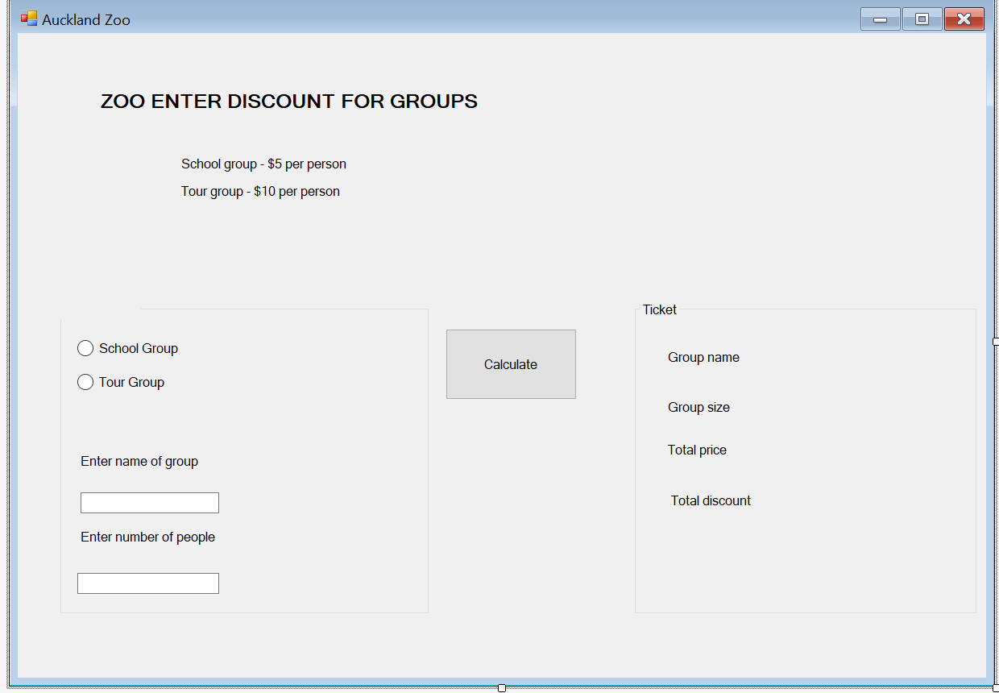

# Group-ticket-management-system

A simple digital group ticket management system could be implemented at Auckland Zoo to streamline the process of purchasing and managing tickets for large groups.

The program looks like:

The administrators can easily calculate the total price by selecting the type of group and entering the number of tourists in the program, which has been designed using the factory method pattern.
